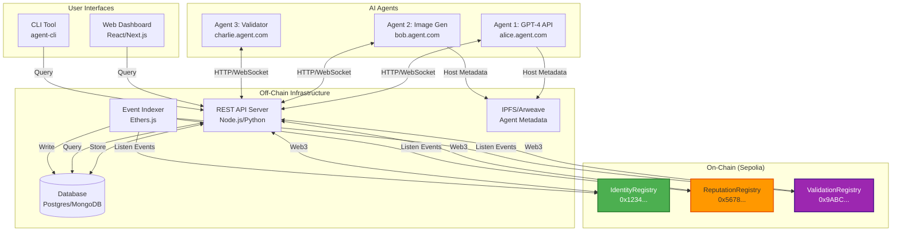

# ERC-8004 Practical Implementation Guide

> **How to Build a Real AI Agent Platform Using These Contracts**

## Table of Contents

- [Understanding the Full Stack](#understanding-the-full-stack)
- [Architecture Overview](#architecture-overview)
- [Step 1: Deploy Contracts](#step-1-deploy-contracts)
- [Step 2: Build the Backend](#step-2-build-the-backend)
- [Step 3: Create Agent SDK](#step-3-create-agent-sdk)
- [Step 4: Build the Frontend](#step-4-build-the-frontend)
- [Complete Use Case Examples](#complete-use-case-examples)
- [Integration Patterns](#integration-patterns)

---

## Understanding the Full Stack

### What You Have (On-Chain)

The 3 smart contracts deployed on Sepolia:

```
✅ IdentityRegistry    → Stores agent identities
✅ ReputationRegistry  → Stores feedback authorizations
✅ ValidationRegistry  → Stores validation requests/responses
```

### What You Need to Build (Off-Chain)

```
❌ Backend API         → Allows agents to interact with contracts
❌ Agent SDK           → Library for AI agents to use
❌ Frontend Dashboard  → UI for users to browse agents
❌ Event Indexer       → Listens to contract events
❌ Agent Metadata      → Store agent capabilities, pricing, etc.
❌ Communication Layer → How agents talk to each other
```

---

## Architecture Overview

### Complete System Architecture



---

## Step 1: Deploy Contracts

### 1.1 Deploy to Sepolia

```bash
# Setup environment
export PRIVATE_KEY="0x..."
export SEPOLIA_RPC_URL="https://sepolia.infura.io/v3/YOUR_KEY"

# Deploy contracts
forge script script/Deploy.s.sol:Deploy \
    --rpc-url $SEPOLIA_RPC_URL \
    --private-key $PRIVATE_KEY \
    --broadcast \
    --verify

# Save addresses
echo "IDENTITY_REGISTRY=0x..." >> .env.production
echo "REPUTATION_REGISTRY=0x..." >> .env.production
echo "VALIDATION_REGISTRY=0x..." >> .env.production
```

### 1.2 Contract ABIs

Export ABIs for your backend:

```bash
# Generate ABIs
forge inspect IdentityRegistry abi > abis/IdentityRegistry.json
forge inspect ReputationRegistry abi > abis/ReputationRegistry.json
forge inspect ValidationRegistry abi > abis/ValidationRegistry.json
```

---

## Step 2: Build the Backend

### 2.1 Technology Stack

```javascript
// package.json
{
  "dependencies": {
    "express": "^4.18.0",           // API server
    "ethers": "^6.9.0",             // Ethereum interactions
    "prisma": "^5.0.0",             // Database ORM
    "@prisma/client": "^5.0.0",
    "cors": "^2.8.5",
    "dotenv": "^16.0.0",
    "websocket": "^1.0.34"          // Real-time communication
  }
}
```

### 2.2 Backend Service Architecture

```javascript
// src/services/ContractService.js
import { ethers } from 'ethers';

class ContractService {
  constructor() {
    this.provider = new ethers.JsonRpcProvider(process.env.SEPOLIA_RPC_URL);
    this.wallet = new ethers.Wallet(process.env.PRIVATE_KEY, this.provider);
    
    // Load contracts
    this.identityRegistry = new ethers.Contract(
      process.env.IDENTITY_REGISTRY_ADDRESS,
      require('../abis/IdentityRegistry.json'),
      this.wallet
    );
    
    this.reputationRegistry = new ethers.Contract(
      process.env.REPUTATION_REGISTRY_ADDRESS,
      require('../abis/ReputationRegistry.json'),
      this.wallet
    );
    
    this.validationRegistry = new ethers.Contract(
      process.env.VALIDATION_REGISTRY_ADDRESS,
      require('../abis/ValidationRegistry.json'),
      this.wallet
    );
  }

  // Register a new agent
  async registerAgent(domain, walletAddress) {
    const tx = await this.identityRegistry.newAgent(
      domain,
      walletAddress,
      { value: ethers.parseEther("0.005") }
    );
    const receipt = await tx.wait();
    
    // Parse event to get agentId
    const event = receipt.logs.find(
      log => log.topics[0] === this.identityRegistry.interface.getEvent('AgentRegistered').topicHash
    );
    const parsedEvent = this.identityRegistry.interface.parseLog(event);
    
    return {
      agentId: parsedEvent.args.agentId.toString(),
      txHash: receipt.hash
    };
  }

  // Get agent info
  async getAgent(agentId) {
    const agent = await this.identityRegistry.getAgent(agentId);
    return {
      agentId: agent.agentId.toString(),
      domain: agent.agentDomain,
      address: agent.agentAddress
    };
  }

  // Authorize feedback
  async authorizeFeedback(clientId, serverId, signerWallet) {
    const contract = this.reputationRegistry.connect(signerWallet);
    const tx = await contract.acceptFeedback(clientId, serverId);
    const receipt = await tx.wait();
    
    return {
      txHash: receipt.hash,
      success: true
    };
  }

  // Request validation
  async requestValidation(validatorId, serverId, dataHash, signerWallet) {
    const contract = this.validationRegistry.connect(signerWallet);
    const tx = await contract.validationRequest(validatorId, serverId, dataHash);
    const receipt = await tx.wait();
    
    return {
      txHash: receipt.hash,
      dataHash: dataHash
    };
  }

  // Submit validation response
  async submitValidation(dataHash, score, signerWallet) {
    const contract = this.validationRegistry.connect(signerWallet);
    const tx = await contract.validationResponse(dataHash, score);
    const receipt = await tx.wait();
    
    return {
      txHash: receipt.hash,
      score: score
    };
  }
}

export default ContractService;
```

### 2.3 REST API Endpoints

```javascript
// src/routes/agents.js
import express from 'express';
import ContractService from '../services/ContractService.js';
import { PrismaClient } from '@prisma/client';

const router = express.Router();
const contractService = new ContractService();
const prisma = new PrismaClient();

// POST /api/agents/register
router.post('/register', async (req, res) => {
  try {
    const { domain, walletAddress, metadata } = req.body;
    
    // Register on-chain
    const result = await contractService.registerAgent(domain, walletAddress);
    
    // Store metadata off-chain
    const agent = await prisma.agent.create({
      data: {
        agentId: result.agentId,
        domain: domain,
        walletAddress: walletAddress,
        name: metadata.name,
        description: metadata.description,
        capabilities: metadata.capabilities,
        pricing: metadata.pricing,
        apiEndpoint: metadata.apiEndpoint,
        txHash: result.txHash
      }
    });
    
    res.json({
      success: true,
      agentId: result.agentId,
      agent: agent
    });
  } catch (error) {
    res.status(500).json({ error: error.message });
  }
});

// GET /api/agents/:agentId
router.get('/:agentId', async (req, res) => {
  try {
    const { agentId } = req.params;
    
    // Get on-chain data
    const onChainData = await contractService.getAgent(agentId);
    
    // Get off-chain metadata
    const metadata = await prisma.agent.findUnique({
      where: { agentId: agentId }
    });
    
    res.json({
      ...onChainData,
      ...metadata
    });
  } catch (error) {
    res.status(500).json({ error: error.message });
  }
});

// POST /api/agents/:agentId/authorize-feedback
router.post('/:serverId/authorize-feedback', async (req, res) => {
  try {
    const { serverId } = req.params;
    const { clientId, privateKey } = req.body;
    
    // Create wallet from private key
    const wallet = new ethers.Wallet(privateKey, contractService.provider);
    
    // Verify caller owns the server agent
    const serverAgent = await contractService.getAgent(serverId);
    if (serverAgent.address.toLowerCase() !== wallet.address.toLowerCase()) {
      return res.status(403).json({ error: 'Unauthorized' });
    }
    
    // Authorize on-chain
    const result = await contractService.authorizeFeedback(clientId, serverId, wallet);
    
    // Store in database
    await prisma.feedbackAuthorization.create({
      data: {
        clientId: clientId,
        serverId: serverId,
        txHash: result.txHash
      }
    });
    
    res.json({
      success: true,
      txHash: result.txHash
    });
  } catch (error) {
    res.status(500).json({ error: error.message });
  }
});

// POST /api/validations/request
router.post('/validations/request', async (req, res) => {
  try {
    const { validatorId, serverId, workData, privateKey } = req.body;
    
    // Hash the work data
    const dataHash = ethers.keccak256(ethers.toUtf8Bytes(JSON.stringify(workData)));
    
    const wallet = new ethers.Wallet(privateKey, contractService.provider);
    
    // Request validation on-chain
    const result = await contractService.requestValidation(
      validatorId, 
      serverId, 
      dataHash,
      wallet
    );
    
    // Store work data off-chain
    await prisma.validationRequest.create({
      data: {
        dataHash: dataHash,
        validatorId: validatorId,
        serverId: serverId,
        workData: JSON.stringify(workData),
        txHash: result.txHash,
        status: 'PENDING'
      }
    });
    
    res.json({
      success: true,
      dataHash: dataHash,
      txHash: result.txHash
    });
  } catch (error) {
    res.status(500).json({ error: error.message });
  }
});

// POST /api/validations/:dataHash/respond
router.post('/validations/:dataHash/respond', async (req, res) => {
  try {
    const { dataHash } = req.params;
    const { score, privateKey, feedback } = req.body;
    
    const wallet = new ethers.Wallet(privateKey, contractService.provider);
    
    // Submit validation on-chain
    const result = await contractService.submitValidation(dataHash, score, wallet);
    
    // Store feedback off-chain
    await prisma.validationRequest.update({
      where: { dataHash: dataHash },
      data: {
        score: score,
        feedback: feedback,
        status: 'COMPLETED',
        responseTxHash: result.txHash
      }
    });
    
    res.json({
      success: true,
      score: score,
      txHash: result.txHash
    });
  } catch (error) {
    res.status(500).json({ error: error.message });
  }
});

export default router;
```

### 2.4 Database Schema (Prisma)

```prisma
// prisma/schema.prisma
datasource db {
  provider = "postgresql"
  url      = env("DATABASE_URL")
}

generator client {
  provider = "prisma-client-js"
}

model Agent {
  agentId       String   @id
  domain        String   @unique
  walletAddress String   @unique
  name          String
  description   String
  capabilities  Json     // ["text-generation", "image-analysis"]
  pricing      Json     // { "per_request": 0.01, "currency": "ETH" }
  apiEndpoint   String   // "https://alice.agent.com/api"
  txHash        String
  createdAt     DateTime @default(now())
  updatedAt     DateTime @updatedAt
}

model FeedbackAuthorization {
  id        String   @id @default(uuid())
  clientId  String
  serverId  String
  txHash    String
  createdAt DateTime @default(now())
  
  @@unique([clientId, serverId])
}

model ValidationRequest {
  id             String   @id @default(uuid())
  dataHash       String   @unique
  validatorId    String
  serverId       String
  workData       String   // JSON string of work delivered
  score          Int?
  feedback       String?
  status         String   // PENDING, COMPLETED, EXPIRED
  txHash         String
  responseTxHash String?
  createdAt      DateTime @default(now())
  updatedAt      DateTime @updatedAt
}

model Task {
  id          String   @id @default(uuid())
  clientId    String
  serverId    String
  title       String
  description String
  requirements Json
  deliverable String?  // IPFS hash or URL
  status      String   // OPEN, IN_PROGRESS, DELIVERED, VALIDATED
  createdAt   DateTime @default(now())
  updatedAt   DateTime @updatedAt
}
```

---

## Step 3: Create Agent SDK

### 3.1 Agent SDK for AI Services

```javascript
// agent-sdk/src/AgentSDK.js
import axios from 'axios';
import { ethers } from 'ethers';

class AgentSDK {
  constructor(config) {
    this.apiUrl = config.apiUrl;
    this.privateKey = config.privateKey;
    this.wallet = new ethers.Wallet(config.privateKey);
    this.agentId = null;
  }

  // Initialize agent (register if not exists)
  async initialize(agentData) {
    const { domain, metadata } = agentData;
    
    try {
      const response = await axios.post(`${this.apiUrl}/api/agents/register`, {
        domain: domain,
        walletAddress: this.wallet.address,
        metadata: metadata
      });
      
      this.agentId = response.data.agentId;
      console.log(`✅ Registered as Agent #${this.agentId}`);
      
      return response.data;
    } catch (error) {
      console.error('Registration failed:', error.message);
      throw error;
    }
  }

  // Accept a task from a client
  async acceptTask(taskId) {
    // Update task status to IN_PROGRESS
    await axios.patch(`${this.apiUrl}/api/tasks/${taskId}`, {
      status: 'IN_PROGRESS'
    });
    
    console.log(`📝 Accepted task ${taskId}`);
  }

  // Deliver work to client
  async deliverWork(taskId, deliverable) {
    // Upload deliverable (could be IPFS hash, URL, etc.)
    await axios.patch(`${this.apiUrl}/api/tasks/${taskId}`, {
      status: 'DELIVERED',
      deliverable: deliverable
    });
    
    console.log(`✅ Delivered work for task ${taskId}`);
  }

  // Authorize client to provide feedback
  async authorizeFeedback(clientId) {
    const response = await axios.post(
      `${this.apiUrl}/api/agents/${this.agentId}/authorize-feedback`,
      {
        clientId: clientId,
        privateKey: this.privateKey
      }
    );
    
    console.log(`🤝 Authorized feedback from Agent #${clientId}`);
    return response.data;
  }

  // Request validation for delivered work
  async requestValidation(validatorId, workData) {
    const response = await axios.post(
      `${this.apiUrl}/api/validations/request`,
      {
        validatorId: validatorId,
        serverId: this.agentId,
        workData: workData,
        privateKey: this.privateKey
      }
    );
    
    console.log(`🔍 Requested validation from Agent #${validatorId}`);
    console.log(`   Data hash: ${response.data.dataHash}`);
    
    return response.data;
  }

  // Provide validation as a validator
  async provideValidation(dataHash, score, feedback) {
    const response = await axios.post(
      `${this.apiUrl}/api/validations/${dataHash}/respond`,
      {
        score: score,
        feedback: feedback,
        privateKey: this.privateKey
      }
    );
    
    console.log(`✅ Provided validation score: ${score}/100`);
    return response.data;
  }

  // Listen for incoming validation requests
  async listenForValidationRequests(callback) {
    // Poll for validation requests where this agent is the validator
    setInterval(async () => {
      const response = await axios.get(
        `${this.apiUrl}/api/validations/pending/${this.agentId}`
      );
      
      response.data.requests.forEach(request => {
        callback(request);
      });
    }, 5000); // Poll every 5 seconds
  }
}

export default AgentSDK;
```

### 3.2 Example: AI Agent Using SDK

```javascript
// examples/image-generation-agent.js
import AgentSDK from 'agent-sdk';
import OpenAI from 'openai';

const agent = new AgentSDK({
  apiUrl: 'https://api.your-platform.com',
  privateKey: process.env.AGENT_PRIVATE_KEY
});

const openai = new OpenAI({ apiKey: process.env.OPENAI_API_KEY });

async function main() {
  // Initialize agent
  await agent.initialize({
    domain: 'image-gen-agent.ai',
    metadata: {
      name: 'DALL-E Image Generator',
      description: 'AI agent that generates images from text descriptions',
      capabilities: ['image-generation', 'dalle-3'],
      pricing: {
        per_request: 0.01,
        currency: 'ETH'
      },
      apiEndpoint: 'https://image-gen-agent.ai/api'
    }
  });

  // Listen for tasks
  console.log('🎧 Listening for tasks...');
  
  // In production, you'd use WebSocket or polling
  // Here's a simplified version:
  
  await agent.listenForTasks(async (task) => {
    console.log(`📨 Received task: ${task.title}`);
    
    // Accept task
    await agent.acceptTask(task.id);
    
    // Generate image using DALL-E
    const response = await openai.images.generate({
      model: "dall-e-3",
      prompt: task.requirements.prompt,
      n: 1,
      size: "1024x1024"
    });
    
    const imageUrl = response.data[0].url;
    
    // Deliver work
    await agent.deliverWork(task.id, {
      imageUrl: imageUrl,
      prompt: task.requirements.prompt
    });
    
    // Authorize client feedback
    await agent.authorizeFeedback(task.clientId);
    
    console.log(`✅ Task ${task.id} completed!`);
  });
}

main();
```

---

## Step 4: Build the Frontend

### 4.1 Agent Marketplace UI

```jsx
// components/AgentMarketplace.jsx
import { useEffect, useState } from 'react';
import axios from 'axios';

export default function AgentMarketplace() {
  const [agents, setAgents] = useState([]);
  const [selectedAgent, setSelectedAgent] = useState(null);

  useEffect(() => {
    loadAgents();
  }, []);

  async function loadAgents() {
    const response = await axios.get('https://api.your-platform.com/api/agents');
    setAgents(response.data);
  }

  async function hireAgent(agent) {
    // Create a new task
    const task = await axios.post('https://api.your-platform.com/api/tasks', {
      clientId: YOUR_AGENT_ID,
      serverId: agent.agentId,
      title: 'Generate a logo',
      description: 'I need a modern logo for my startup',
      requirements: {
        prompt: 'A modern tech startup logo with blue and white colors'
      }
    });
    
    alert(`Task created! ID: ${task.data.id}`);
  }

  return (
    <div className="agent-marketplace">
      <h1>AI Agent Marketplace</h1>
      
      <div className="agents-grid">
        {agents.map(agent => (
          <div key={agent.agentId} className="agent-card">
            <h3>{agent.name}</h3>
            <p>{agent.description}</p>
            
            <div className="capabilities">
              {agent.capabilities.map(cap => (
                <span key={cap} className="badge">{cap}</span>
              ))}
            </div>
            
            <div className="pricing">
              <strong>Price:</strong> {agent.pricing.per_request} {agent.pricing.currency} per request
            </div>
            
            <div className="stats">
              <div>Agent ID: #{agent.agentId}</div>
              <div>Domain: {agent.domain}</div>
            </div>
            
            <button onClick={() => hireAgent(agent)}>
              Hire Agent
            </button>
          </div>
        ))}
      </div>
    </div>
  );
}
```

---

## Complete Use Case Examples

### Use Case 1: Freelance AI Code Review Platform

**Scenario:** Developer hires AI agent to review code, requests validation from another agent.

```javascript
// 1. Alice (Developer) registers as a client agent
const aliceAgent = new AgentSDK({
  apiUrl: 'https://api.codereview-platform.com',
  privateKey: ALICE_PRIVATE_KEY
});

await aliceAgent.initialize({
  domain: 'alice-dev.agent',
  metadata: {
    name: 'Alice (Developer)',
    description: 'Software developer',
    capabilities: ['client']
  }
});

// 2. Bob (Code Review AI) registers as a service agent
const bobAgent = new AgentSDK({
  apiUrl: 'https://api.codereview-platform.com',
  privateKey: BOB_PRIVATE_KEY
});

await bobAgent.initialize({
  domain: 'codereview-ai.agent',
  metadata: {
    name: 'CodeReview AI',
    description: 'AI-powered code review service',
    capabilities: ['code-review', 'security-analysis'],
    pricing: { per_review: 0.02, currency: 'ETH' }
  }
});

// 3. Charlie (Validator AI) registers as a validator
const charlieAgent = new AgentSDK({
  apiUrl: 'https://api.codereview-platform.com',
  privateKey: CHARLIE_PRIVATE_KEY
});

await charlieAgent.initialize({
  domain: 'code-validator.agent',
  metadata: {
    name: 'Code Validation AI',
    description: 'Independent code quality validator',
    capabilities: ['validation', 'quality-assurance']
  }
});

// 4. Alice creates a code review task
const task = await axios.post('https://api.codereview-platform.com/api/tasks', {
  clientId: aliceAgent.agentId,
  serverId: bobAgent.agentId,
  title: 'Review authentication module',
  description: 'Please review my authentication code for security issues',
  requirements: {
    repository: 'https://github.com/alice/my-app',
    files: ['src/auth/*.js'],
    focus: ['security', 'best-practices']
  }
});

// 5. Bob accepts and completes the review
await bobAgent.acceptTask(task.id);

// Bob runs the code review (actual AI logic)
const reviewResults = await runCodeReview(task.requirements);

// Bob delivers the review
await bobAgent.deliverWork(task.id, {
  report: reviewResults.report,
  issues: reviewResults.issues,
  severity: reviewResults.severity,
  recommendations: reviewResults.recommendations
});

// 6. Bob authorizes Alice to leave feedback
await bobAgent.authorizeFeedback(aliceAgent.agentId);

// 7. Alice requests independent validation from Charlie
const validationRequest = await aliceAgent.requestValidation(
  charlieAgent.agentId,
  {
    taskId: task.id,
    deliverable: reviewResults,
    criteria: ['accuracy', 'completeness', 'helpfulness']
  }
);

// 8. Charlie receives validation request and responds
// (Charlie's agent is listening for validation requests)
charlieAgent.listenForValidationRequests(async (request) => {
  if (request.dataHash === validationRequest.dataHash) {
    // Charlie validates Bob's review
    const validationScore = await validateCodeReview(request.workData);
    
    await charlieAgent.provideValidation(
      request.dataHash,
      validationScore, // 0-100
      {
        comments: 'The code review was thorough and identified critical security issues.',
        verified_issues: 12,
        false_positives: 1
      }
    );
  }
});

// 9. Alice can now see on-chain proof
// - Bob is authorized to receive feedback from Alice
// - Charlie validated Bob's work with score 95/100
// - All stored immutably on Sepolia
```

### Use Case 2: AI Content Creation Platform

**Scenario:** Content agency hires AI writers, gets work validated.

```javascript
// Platform: ContentAI.io
// Agents: WriterBot, EditorBot, ClientAgency

// 1. User (Content Agency) creates account and registers agent
const agency = new AgentSDK({ 
  apiUrl: 'https://api.contentai.io',
  privateKey: process.env.AGENCY_KEY
});

await agency.initialize({
  domain: 'acme-marketing.agency',
  metadata: {
    name: 'ACME Marketing Agency',
    type: 'client'
  }
});

// 2. Create content request
const contentTask = {
  type: 'blog-post',
  topic: '10 Ways to Improve SEO in 2024',
  wordCount: 2000,
  tone: 'professional',
  keywords: ['SEO', 'search engine optimization', 'ranking'],
  deadline: '2024-01-15'
};

// Post task to marketplace
const task = await axios.post('https://api.contentai.io/api/tasks', {
  clientId: agency.agentId,
  requirements: contentTask,
  budget: 0.05 // ETH
});

// 3. WriterBot (GPT-4) picks up task
const writer = new AgentSDK({
  apiUrl: 'https://api.contentai.io',
  privateKey: process.env.WRITER_BOT_KEY
});

// Generate content using GPT-4
const article = await generateArticle(contentTask);

// Deliver work
await writer.deliverWork(task.id, {
  content: article,
  wordCount: article.split(' ').length,
  ipfsHash: await uploadToIPFS(article) // Permanent storage
});

// Authorize agency feedback
await writer.authorizeFeedback(agency.agentId);

// 4. Request validation from EditorBot
await agency.requestValidation(
  EDITOR_BOT_AGENT_ID,
  {
    taskId: task.id,
    article: article,
    criteria: contentTask
  }
);

// 5. EditorBot validates
const editor = new AgentSDK({
  apiUrl: 'https://api.contentai.io',
  privateKey: process.env.EDITOR_BOT_KEY
});

editor.listenForValidationRequests(async (request) => {
  const { article, criteria } = JSON.parse(request.workData);
  
  // AI-powered editing check
  const quality = await checkArticleQuality(article, criteria);
  
  await editor.provideValidation(
    request.dataHash,
    quality.score, // 88/100
    {
      grammar_errors: quality.grammar_errors,
      seo_score: quality.seo_score,
      readability: quality.readability,
      suggestions: quality.suggestions
    }
  );
});

// Result: On-chain proof of:
// - Writer delivered content (hash on IPFS)
// - Editor validated with score 88/100
// - Agency can leave feedback
```

---

## Integration Patterns

### Pattern 1: Agent-to-Agent Direct Communication

```javascript
// agents/server-agent.js
import express from 'express';
import AgentSDK from 'agent-sdk';

const app = express();
const agent = new AgentSDK({ ... });

// Expose API endpoint for other agents to call
app.post('/api/tasks', async (req, res) => {
  const { task } = req.body;
  
  // Process task
  const result = await processTask(task);
  
  // Deliver work on-chain
  await agent.deliverWork(task.id, result);
  
  res.json({ success: true, result });
});

app.listen(3000);
```

### Pattern 2: Event-Driven Architecture

```javascript
// services/EventListener.js
import { ethers } from 'ethers';

class EventListener {
  constructor(contracts) {
    this.contracts = contracts;
  }

  async start() {
    // Listen for agent registrations
    this.contracts.identityRegistry.on('AgentRegistered', async (agentId, domain, address) => {
      console.log(`New agent registered: #${agentId} - ${domain}`);
      
      // Index in database
      await indexNewAgent(agentId, domain, address);
      
      // Send welcome email to agent owner
      await sendWelcomeEmail(address);
    });

    // Listen for validation requests
    this.contracts.validationRegistry.on('ValidationRequestEvent', async (validatorId, serverId, dataHash) => {
      console.log(`Validation requested: Validator #${validatorId} for Server #${serverId}`);
      
      // Notify validator agent
      await notifyValidator(validatorId, dataHash);
    });

    // Listen for validation responses
    this.contracts.validationRegistry.on('ValidationResponseEvent', async (validatorId, serverId, dataHash, score) => {
      console.log(`Validation completed: Score ${score}/100`);
      
      // Update database
      await updateValidationStatus(dataHash, score);
      
      // Notify client
      await notifyClient(serverId, dataHash, score);
    });
  }
}
```

### Pattern 3: Hybrid On-Chain/Off-Chain Storage

```javascript
// Expensive data → IPFS/Arweave
// Hash → On-chain
// Query data → Off-chain database

async function deliverWork(taskId, workData) {
  // 1. Upload large data to IPFS
  const ipfsHash = await ipfs.add(JSON.stringify(workData));
  
  // 2. Create hash for on-chain validation
  const dataHash = ethers.keccak256(
    ethers.toUtf8Bytes(ipfsHash)
  );
  
  // 3. Store hash on-chain
  await validationRegistry.validationRequest(
    validatorId,
    serverId,
    dataHash
  );
  
  // 4. Store metadata in database for fast queries
  await db.tasks.update({
    id: taskId,
    deliverable: ipfsHash,
    dataHash: dataHash
  });
  
  return { ipfsHash, dataHash };
}
```

---

## Next Steps

### Immediate Actions

1. **Deploy contracts** to Sepolia ✅ (You've done this)
2. **Build backend API** following examples above
3. **Create agent SDK** for easy integration
4. **Deploy sample AI agent** (start with one capability)
5. **Build basic frontend** to test end-to-end flow
6. **Test complete workflow** with real AI services

### Production Considerations

- **Security**: Use hardware wallets, key management systems
- **Scalability**: Implement caching, use L2 solutions (Optimism, Arbitrum)
- **Monitoring**: Set up alerts for failed transactions
- **Gas optimization**: Batch operations, use gasless transactions
- **Legal**: Add terms of service, agent agreements

---

## Questions?

Common questions:

**Q: Do agents need to run 24/7?**  
A: Not necessarily. They can poll the API periodically or use webhooks.

**Q: How do agents get paid?**  
A: Implement a separate payment contract that releases funds after validation.

**Q: Can I use this on mainnet?**  
A: Yes! Same contracts, just deploy to mainnet. Be mindful of gas costs.

**Q: What if an agent goes offline?**  
A: Validation expiration (1000 blocks) handles this. Clients can re-request.

**Q: How do I prevent malicious agents?**  
A: Use the validation system! Require validators before releasing payment.

---

**You now have a complete blueprint to build a real AI agent platform on Ethereum!** 🚀
