# ERC-8004: Trustless Agents Reference Implementation

> **A decentralized protocol for autonomous agent identity, reputation, and validation on Ethereum**

## Table of Contents

- [Overview](#overview)
- [Architecture](#architecture)
- [Core Concepts](#core-concepts)
- [Contract Specifications](#contract-specifications)
- [User Flows](#user-flows)
- [Deployment](#deployment)
- [Usage Examples](#usage-examples)
- [Testing](#testing)
- [Gas Optimization](#gas-optimization)

---

## Overview

ERC-8004 Trustless Agents is a proposed Ethereum standard that enables autonomous agents (AI bots, services, or users) to establish verifiable on-chain identities, build reputation through peer feedback, and request independent validation of their work.

### Key Features

- ✅ **Decentralized Identity**: Agents register unique identities with domains and addresses
- 🔥 **Fee Burning Mechanism**: 0.005 ETH registration fee is permanently locked (deflationary)
- 🤝 **Reputation Building**: Server agents authorize clients to provide feedback
- ✔️ **Independent Validation**: Trustless validation requests with expiration
- 🔒 **Access Control**: Owner-based authorization for all operations
- 🌐 **Cross-Registry Integration**: Three modular contracts working together

### Use Cases

1. **Freelance Platforms**: Clients hire agents, request validation, leave feedback
2. **AI Agent Marketplaces**: Autonomous agents build verifiable reputation
3. **Service Provider Networks**: Decentralized rating and validation systems
4. **DAO Contributor Verification**: On-chain proof of work and peer validation

---

## Architecture

### System Architecture Diagram


### Contract Dependencies


**Deployment Order:**
1. Deploy `IdentityRegistry` (no dependencies)
2. Deploy `ReputationRegistry(identityRegistryAddress)`
3. Deploy `ValidationRegistry(identityRegistryAddress)`

---

## Core Concepts

### 1. Agent Identity

Every agent in the system has a unique on-chain identity consisting of:

| Field | Type | Description |
|-------|------|-------------|
| **agentId** | `uint256` | Unique sequential ID (starts from 1) |
| **agentDomain** | `string` | Domain where agent's AgentCard is hosted (e.g., "alice.agent") |
| **agentAddress** | `address` | Ethereum address controlling the agent |

**Key Properties:**
- Sequential ID assignment (1, 2, 3, ...)
- One-time registration fee: **0.005 ETH** (burned/locked)
- Bi-directional lookups: by ID, domain, or address
- Mutable: Agents can update domain or address

### 2. Feedback Authorization

A mechanism for server agents to authorize clients to provide feedback:

```
Server Agent → authorizes → Client Agent → can leave feedback
```

**Authorization Process:**
1. Server completes work for Client
2. Server calls `acceptFeedback(clientId, serverId)`
3. System generates unique `feedbackAuthId`
4. Authorization is permanent and queryable on-chain

**Use Case:** Prevents spam feedback; only authorized clients can rate servers.

### 3. Validation Requests

Independent third-party validation of agent work:

```
Server Agent → requests validation → Validator Agent → submits score (0-100)
```

**Validation Lifecycle:**
1. **Request**: Anyone creates a validation request with `dataHash`
2. **Pending**: Request is valid for **1000 blocks** (~3.5 hours on Ethereum)
3. **Response**: Designated validator submits score (0-100)
4. **Complete**: Response is permanent; request marked as responded

**Expiration Logic:**
- After 1000 blocks, validator can no longer respond
- Expired requests can be re-created with new timestamp

---

## Contract Specifications

### IdentityRegistry

**Purpose:** Foundation layer for agent identity management.

#### State Variables

```solidity
uint256 private _agentIdCounter;              // Sequential ID counter
mapping(uint256 => AgentInfo) private _agents; // ID → Agent data
mapping(string => uint256) private _domainToAgentId;   // Domain → ID
mapping(address => uint256) private _addressToAgentId; // Address → ID
```

#### Key Functions

| Function | Access | Description |
|----------|--------|-------------|
| `newAgent(domain, address)` | Public (payable) | Register new agent with 0.005 ETH fee |
| `updateAgent(id, newDomain, newAddress)` | Owner only | Update agent domain or address |
| `getAgent(id)` | Public view | Get agent by ID |
| `resolveByDomain(domain)` | Public view | Resolve agent by domain |
| `resolveByAddress(address)` | Public view | Resolve agent by address |
| `agentExists(id)` | Public view | Check if agent exists |
| `getAgentCount()` | Public view | Total registered agents |

#### Events

```solidity
event AgentRegistered(uint256 indexed agentId, string agentDomain, address agentAddress);
event AgentUpdated(uint256 indexed agentId, string agentDomain, address agentAddress);
```

#### Error Conditions

- `InsufficientFee()`: Fee ≠ 0.005 ETH
- `InvalidDomain()`: Empty domain string
- `InvalidAddress()`: Zero address
- `DomainAlreadyRegistered()`: Domain already taken
- `AddressAlreadyRegistered()`: Address already registered
- `AgentNotFound()`: Agent ID doesn't exist
- `UnauthorizedUpdate()`: Caller is not agent owner

---

### ReputationRegistry

**Purpose:** Manage feedback authorization between agents.

#### State Variables

```solidity
IIdentityRegistry public immutable identityRegistry;  // Reference to IdentityRegistry
mapping(bytes32 => bool) private _feedbackAuthorizations;  // Auth ID → exists
mapping(uint256 => mapping(uint256 => bytes32)) private _clientServerToAuthId;  // Client→Server→AuthID
```

#### Key Functions

| Function | Access | Description |
|----------|--------|-------------|
| `acceptFeedback(clientId, serverId)` | Server agent only | Authorize client to provide feedback |
| `isFeedbackAuthorized(clientId, serverId)` | Public view | Check if feedback is authorized |
| `getFeedbackAuthId(clientId, serverId)` | Public view | Get authorization ID |

#### FeedbackAuthId Generation

```solidity
keccak256(abi.encodePacked(
    agentClientId,
    agentServerId,
    block.timestamp,
    block.difficulty,
    tx.origin
))
```

Ensures uniqueness through timestamp, block difficulty, and transaction origin.

#### Events

```solidity
event AuthFeedback(
    uint256 indexed agentClientId,
    uint256 indexed agentServerId,
    bytes32 indexed feedbackAuthId
);
```

#### Error Conditions

- `AgentNotFound()`: Client or server doesn't exist
- `UnauthorizedFeedback()`: Caller is not server agent
- `FeedbackAlreadyAuthorized()`: Authorization already exists

---

### ValidationRegistry

**Purpose:** Enable independent validation of agent work with expiration.

#### State Variables

```solidity
uint256 public constant EXPIRATION_SLOTS = 1000;  // Request validity period
IIdentityRegistry public immutable identityRegistry;  // Reference
mapping(bytes32 => Request) private _validationRequests;  // Hash → Request
mapping(bytes32 => uint8) private _validationResponses;   // Hash → Score
mapping(bytes32 => bool) private _hasResponse;            // Hash → Responded
```

#### Request Structure

```solidity
struct Request {
    uint256 agentValidatorId;  // Designated validator
    uint256 agentServerId;      // Server being validated
    bytes32 dataHash;           // Hash of validated data
    uint256 timestamp;          // Block number when created
    bool responded;             // Has validator responded?
}
```

#### Key Functions

| Function | Access | Description |
|----------|--------|-------------|
| `validationRequest(validatorId, serverId, dataHash)` | Public | Create validation request |
| `validationResponse(dataHash, score)` | Validator only | Submit validation score (0-100) |
| `getValidationRequest(dataHash)` | Public view | Get request details |
| `isValidationPending(dataHash)` | Public view | Check if pending |
| `getValidationResponse(dataHash)` | Public view | Get response score |

#### Expiration Logic

```solidity
bool expired = block.number > request.timestamp + EXPIRATION_SLOTS;
bool pending = !expired && !request.responded;
```

Requests are pending only if:
- Current block ≤ timestamp + 1000
- Not yet responded

#### Events

```solidity
event ValidationRequestEvent(
    uint256 indexed agentValidatorId,
    uint256 indexed agentServerId,
    bytes32 indexed dataHash
);

event ValidationResponseEvent(
    uint256 indexed agentValidatorId,
    uint256 indexed agentServerId,
    bytes32 indexed dataHash,
    uint8 response
);
```

#### Error Conditions

- `InvalidDataHash()`: Zero data hash
- `AgentNotFound()`: Validator or server doesn't exist
- `ValidationRequestNotFound()`: Request doesn't exist
- `RequestExpired()`: Block number > timestamp + 1000
- `ValidationAlreadyResponded()`: Duplicate response
- `UnauthorizedValidator()`: Caller is not designated validator
- `InvalidResponse()`: Score > 100

---

## User Flows

### Flow 1: Complete Agent Onboarding and Interaction


### Flow 2: Agent Update and Ownership Transfer


### Flow 3: Validation with Expiration

```mermaid
sequenceDiagram
    participant Alice as Alice
    participant Bob as Bob<br/>(Validator)
    participant VR as ValidationRegistry

    Note over Alice,VR: Create validation request
    Alice->>VR: validationRequest(validatorId=2, serverId=1, dataHash)
    VR-->>Alice: Request created at block 100

    Note over Alice,VR: Scenario 1: Response before expiration
    Note over Bob,VR: Block: 900 (< 100 + 1000)
    Bob->>VR: validationResponse(dataHash, score=85)
    VR-->>Bob: ✓ Response recorded

    rect rgb(255, 240, 240)
    Note over Alice,VR: Scenario 2: Response after expiration
    Note over Bob,VR: Block: 1101 (> 100 + 1000)
    Bob->>VR: validationResponse(dataHash, score=85)
    VR-->>Bob: ✗ RequestExpired()
    end

    Note over Alice,VR: Scenario 3: Re-request after expiration
    Alice->>VR: validationRequest(validatorId=2, serverId=1, dataHash)
    VR->>VR: Create new request at block 1101
    VR-->>Alice: ✓ New request created

    Note over Bob,VR: Block: 1200
    Bob->>VR: validationResponse(dataHash, score=90)
    VR-->>Bob: ✓ Response recorded
```



---

## Deployment

### Prerequisites

- Foundry toolkit installed
- Funded deployer account
- RPC endpoint (e.g., Sepolia, Mainnet)

### Deployment Script

The project includes [`Deploy.s.sol`](file:///Users/anderson/Workspace/erc-8004-contracts/script/Deploy.s.sol) for automated deployment:

```solidity
// Deploy in correct dependency order
IdentityRegistry identityRegistry = new IdentityRegistry();
ReputationRegistry reputationRegistry = new ReputationRegistry(address(identityRegistry));
ValidationRegistry validationRegistry = new ValidationRegistry(address(identityRegistry));
```

### Deploy to Sepolia

```bash
# Set environment variables
export PRIVATE_KEY=0x...
export SEPOLIA_RPC_URL=https://sepolia.infura.io/v3/YOUR_KEY

# Deploy
forge script script/Deploy.s.sol:Deploy \
    --rpc-url $SEPOLIA_RPC_URL \
    --private-key $PRIVATE_KEY \
    --broadcast \
    --verify
```

### Deploy to Mainnet

```bash
export MAINNET_RPC_URL=https://mainnet.infura.io/v3/YOUR_KEY

forge script script/Deploy.s.sol:Deploy \
    --rpc-url $MAINNET_RPC_URL \
    --private-key $PRIVATE_KEY \
    --broadcast \
    --verify \
    --etherscan-api-key $ETHERSCAN_API_KEY
```

### Deployed Contract Addresses

After deployment, you'll receive:

```
=== Deployment Summary ===
IdentityRegistry:    0x1234...
ReputationRegistry:  0x5678...
ValidationRegistry:  0x9ABC...

Registration fee:      5000000000000000 (0.005 ETH)
Validation expiration: 1000 blocks
```

---

## Usage Examples

### Example 1: Register an Agent

```solidity
// Connect to IdentityRegistry contract
IIdentityRegistry identityRegistry = IIdentityRegistry(0x1234...);

// Register with 0.005 ETH
uint256 agentId = identityRegistry.newAgent{value: 0.005 ether}(
    "myagent.ai",
    msg.sender
);

// Query agent info
IIdentityRegistry.AgentInfo memory agent = identityRegistry.getAgent(agentId);
console.log("Registered as agentId:", agent.agentId);
console.log("Domain:", agent.agentDomain);
console.log("Address:", agent.agentAddress);
```

### Example 2: Authorize Feedback

```solidity
// Server authorizes client to provide feedback
IReputationRegistry reputationRegistry = IReputationRegistry(0x5678...);

uint256 clientId = 1;  // Alice
uint256 serverId = 2;  // Bob (caller must be Bob's address)

reputationRegistry.acceptFeedback(clientId, serverId);

// Query authorization
(bool isAuthorized, bytes32 authId) = reputationRegistry.isFeedbackAuthorized(
    clientId,
    serverId
);

if (isAuthorized) {
    console.log("Feedback authorized with ID:", authId);
}
```

### Example 3: Request and Submit Validation

```solidity
IValidationRegistry validationRegistry = IValidationRegistry(0x9ABC...);

// Step 1: Create validation request
bytes32 dataHash = keccak256(abi.encodePacked("project-deliverable-v1"));
uint256 validatorId = 3;  // Charlie
uint256 serverId = 2;     // Bob

validationRegistry.validationRequest(validatorId, serverId, dataHash);

// Step 2: Validator submits response (must be Charlie)
uint8 score = 95;  // 0-100
validationRegistry.validationResponse(dataHash, score);

// Step 3: Query response
(bool hasResponse, uint8 responseScore) = validationRegistry.getValidationResponse(dataHash);

if (hasResponse) {
    console.log("Validation score:", responseScore);
}
```

### Example 4: Update Agent Information

```solidity
// Update domain only
identityRegistry.updateAgent(
    agentId,
    "new-domain.ai",  // New domain
    address(0)        // Keep current address
);

// Update address only
identityRegistry.updateAgent(
    agentId,
    "",               // Keep current domain
    0xNewAddress      // New address
);

// Update both
identityRegistry.updateAgent(
    agentId,
    "another-domain.ai",
    0xAnotherAddress
);
```

---

## Testing

### Test Suite Overview

The project includes **90 comprehensive tests** across 4 test files:

| Test File | Tests | Coverage |
|-----------|-------|----------|
| [IdentityRegistry.t.sol](file:///Users/anderson/Workspace/erc-8004-contracts/test/IdentityRegistry.t.sol) | 30 | Registration, updates, queries, validation |
| [ReputationRegistry.t.sol](file:///Users/anderson/Workspace/erc-8004-contracts/test/ReputationRegistry.t.sol) | 19 | Feedback authorization, uniqueness |
| [ValidationRegistry.t.sol](file:///Users/anderson/Workspace/erc-8004-contracts/test/ValidationRegistry.t.sol) | 28 | Requests, responses, expiration |
| [Integration.t.sol](file:///Users/anderson/Workspace/erc-8004-contracts/test/Integration.t.sol) | 13 | Multi-contract workflows, scenarios |

### Run Tests

```bash
# Run all tests
forge test

# Run with verbosity
forge test -vvv

# Run specific test file
forge test --match-contract IdentityRegistryTest

# Run specific test
forge test --match-test test_NewAgent_Success

# Generate coverage report
forge coverage
```

### Test Results

```
Ran 4 test suites: 90 tests passed, 0 failed, 0 skipped
✅ 100% pass rate
```

### Gas Snapshots

```bash
# Generate gas snapshots
forge snapshot

# View gas usage
cat .gas-snapshot
```

Key gas benchmarks:
- Agent registration: ~143k gas
- Feedback authorization: ~85k gas
- Validation request: ~124k gas
- Validation response: ~182k gas

---

## Gas Optimization

### Registration Fee Economics

- **Fee**: 0.005 ETH per registration
- **Mechanism**: Fee is locked in contract (never withdrawn)
- **Effect**: Deflationary; reduces circulating ETH supply
- **Purpose**: Spam prevention and value capture

### Storage Optimizations

1. **Packed Structs**: AgentInfo uses efficient packing
2. **Immutable References**: IdentityRegistry address is immutable
3. **Mapping Efficiency**: Direct lookups avoid iteration
4. **Event Indexing**: Three indexed parameters for efficient filtering

### Gas Comparison

| Operation | Gas Cost | Notes |
|-----------|----------|-------|
| Register new agent | ~143k | Includes 3 SSTORE operations |
| Update agent (domain) | ~161k | 2 SSTORE + 1 SDELETE |
| Update agent (address) | ~161k | 2 SSTORE + 1 SDELETE |
| Authorize feedback | ~85k | Generate hash + 3 SSTORE |
| Create validation request | ~124k | 5 SSTORE operations |
| Submit validation response | ~182k | Hash verification + SSTORE |

---

## Architecture Patterns

### 1. Registry Pattern

All three contracts follow the **Registry Pattern**:
- Central storage of structured data
- Indexed lookups (ID, domain, address)
- Event emission for off-chain indexing

### 2. Immutable Dependencies

```solidity
IIdentityRegistry public immutable identityRegistry;
```

Benefits:
- Gas savings (SLOAD → cheaper opcode)
- Security (cannot be changed after deployment)
- Clear dependency graph

### 3. Access Control

Owner-based authorization:
```solidity
if (msg.sender != agent.agentAddress) {
    revert UnauthorizedUpdate();
}
```

No role-based access control needed; simplicity over complexity.

### 4. Expiration via Block Numbers

```solidity
uint256 public constant EXPIRATION_SLOTS = 1000;
bool expired = block.number > request.timestamp + EXPIRATION_SLOTS;
```

Block-based expiration is more reliable than timestamp-based on Ethereum.

---

## Security Considerations

### 1. Reentrancy Protection

No reentrancy guards needed because:
- No external calls before state changes
- Fee burning doesn't involve transfers
- All state updates follow checks-effects pattern

### 2. Integer Overflow

Safe with Solidity 0.8.19+:
- Built-in overflow/underflow checks
- Counter increments are safe

### 3. Front-Running

Potential vectors:
- **Domain registration**: First transaction wins (unavoidable)
- **Feedback authorization**: Idempotent; no harm in front-running
- **Validation response**: Single validator; front-running irrelevant

### 4. Fee Burning Mechanism

```solidity
// Fee stays locked forever
if (msg.value != REGISTRATION_FEE) {
    revert InsufficientFee();
}
// No transfer; ETH remains in contract
```

**Implications:**
- Contract balance grows forever
- ETH is effectively burned (deflationary)
- No withdrawal function = no rug pull risk

### 5. Data Availability

All critical data emitted as events:
- `AgentRegistered`, `AgentUpdated`
- `AuthFeedback`
- `ValidationRequestEvent`, `ValidationResponseEvent`

Off-chain indexers can rebuild full state from events.

---

## Future Enhancements

### Potential Extensions

1. **Reputation Score Aggregation**
   - Calculate average validation scores
   - Weighted reputation based on validator trust

2. **Delegation Support**
   - Allow agents to delegate update permissions
   - Multi-sig authorization for updates

3. **Dispute Resolution**
   - On-chain arbitration for contested validations
   - Slash validators for malicious responses

4. **Cross-Chain Support**
   - Bridge agent identities to L2s
   - Multi-chain validation proofs

5. **Agent Discovery**
   - On-chain registry of agent capabilities
   - Search and filter by domain patterns

6. **Economic Incentives**
   - Reward validators for honest responses
   - Stake/slash mechanism for quality control

---

## FAQ

### Q: What happens to the 0.005 ETH registration fee?

**A:** The fee stays locked in the IdentityRegistry contract forever. There is no withdrawal function. This creates a deflationary effect on the circulating ETH supply.

### Q: Can an agent change their domain after registration?

**A:** Yes, the agent owner can call `updateAgent()` to change their domain or address at any time.

### Q: What happens if a validator doesn't respond within 1000 blocks?

**A:** The request expires. The requester can create a new request with the same `dataHash`, which will have a new timestamp and be valid for another 1000 blocks.

### Q: Can an agent validate their own work?

**A:** Technically yes, but it defeats the purpose. The system doesn't prevent self-validation, as the economic incentive is for clients to request independent validators.

### Q: Are validation scores public?

**A:** Yes, all validation responses are stored on-chain and publicly queryable via `getValidationResponse()`.

### Q: Can a validator change their response?

**A:** No, responses are immutable. Once submitted, the `responded` flag prevents duplicate responses.

### Q: What prevents spam validation requests?

**A:** Nothing directly, but since requests are free, the expiration mechanism prevents DoS. Also, validators can ignore requests not worth their time.

### Q: How do I know if my agent's address was updated?

**A:** Listen for the `AgentUpdated` event, or query `getAgent(id)` periodically to check.

---

## Resources

- **Foundry Documentation**: https://book.getfoundry.sh/
- **Solidity Documentation**: https://docs.soliditylang.org/
- **OpenZeppelin Contracts**: https://docs.openzeppelin.com/contracts/
- **Ethereum Yellow Paper**: https://ethereum.github.io/yellowpaper/

---

## License

MIT License - see LICENSE file for details.

---

## Contributing

Contributions are welcome! Please:

1. Fork the repository
2. Create a feature branch
3. Add tests for new functionality
4. Ensure all tests pass (`forge test`)
5. Submit a pull request

---

## Contact

For questions or support, please open an issue on GitHub.

---

**Built with ❤️ for the decentralized agent economy**
