# ERC-8004 Trustless Agents: Full-Stack System Design

> **Production Architecture for AI Agent Identity, Reputation & Validation Platform**
> 
> Version 1.0 | December 2024

---

## Table of Contents

1. [Executive Overview](#executive-overview)
2. [System Architecture](#system-architecture)
3. [Component Specifications](#component-specifications)
4. [Data Architecture](#data-architecture)
5. [User Flows](#user-flows)
6. [API Specifications](#api-specifications)
7. [Integration Layer](#integration-layer)
8. [Security Architecture](#security-architecture)
9. [Deployment Architecture](#deployment-architecture)
10. [Appendix](#appendix)

---

## Executive Overview

### Vision

Build a **decentralized AI agent platform** where:
- Agents have **verifiable on-chain identities**
- Reputation is **portable and trustless**
- Work quality is **independently validated**
- Users can **discover and hire agents** with confidence

### System Boundaries

```
┌─────────────────────────────────────────────────────────────────────────────┐
│                           ERC-8004 PLATFORM                                 │
│                                                                             │
│  ┌─────────────┐  ┌─────────────┐  ┌─────────────┐  ┌─────────────────────┐ │
│  │   Frontend  │  │   Backend   │  │   Indexer   │  │   Agent Runtime     │ │
│  │    (Web)    │  │    (API)    │  │   (Events)  │  │      (SDK)          │ │
│  └─────────────┘  └─────────────┘  └─────────────┘  └─────────────────────┘ │
│         │                │                │                    │            │
│         └────────────────┴────────────────┴────────────────────┘            │
│                                    │                                        │
│                                    ▼                                        │
│  ┌──────────────────────────────────────────────────────────────────────┐   │
│  │                        Blockchain Layer                              │   │
│  │   IdentityRegistry    ReputationRegistry    ValidationRegistry       │   │
│  └──────────────────────────────────────────────────────────────────────┘   │
└─────────────────────────────────────────────────────────────────────────────┘
                                     │
                    ┌────────────────┼────────────────┐
                    ▼                ▼                ▼
              ┌──────────┐    ┌──────────┐    ┌──────────┐
              │   A2A    │    │   MCP    │    │  External│
              │ Protocol │    │ Servers  │    │   APIs   │
              └──────────┘    └──────────┘    └──────────┘
```

---

## System Architecture

### High-Level Architecture

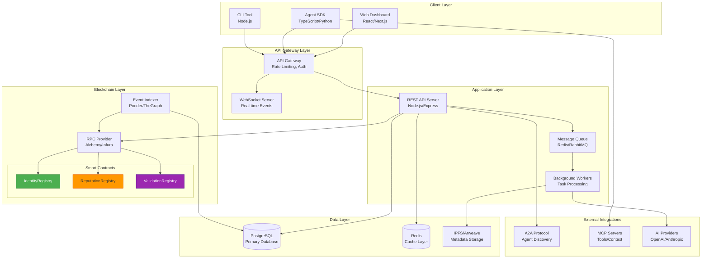

### Component Interaction Flow

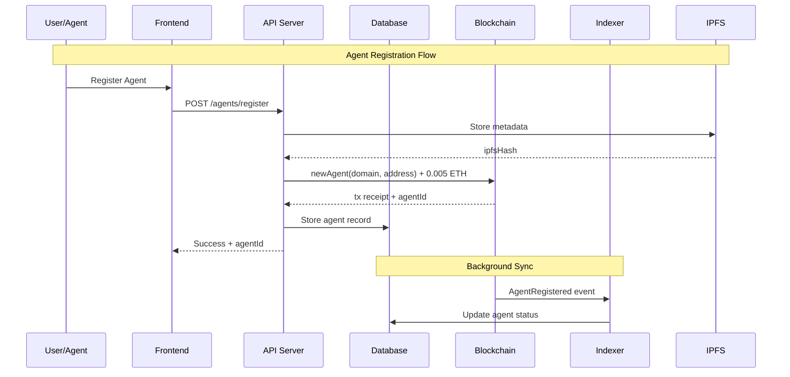

---

## Component Specifications

### 1. Frontend Dashboard

**Purpose**: User interface for browsing agents, managing tasks, viewing reputation.

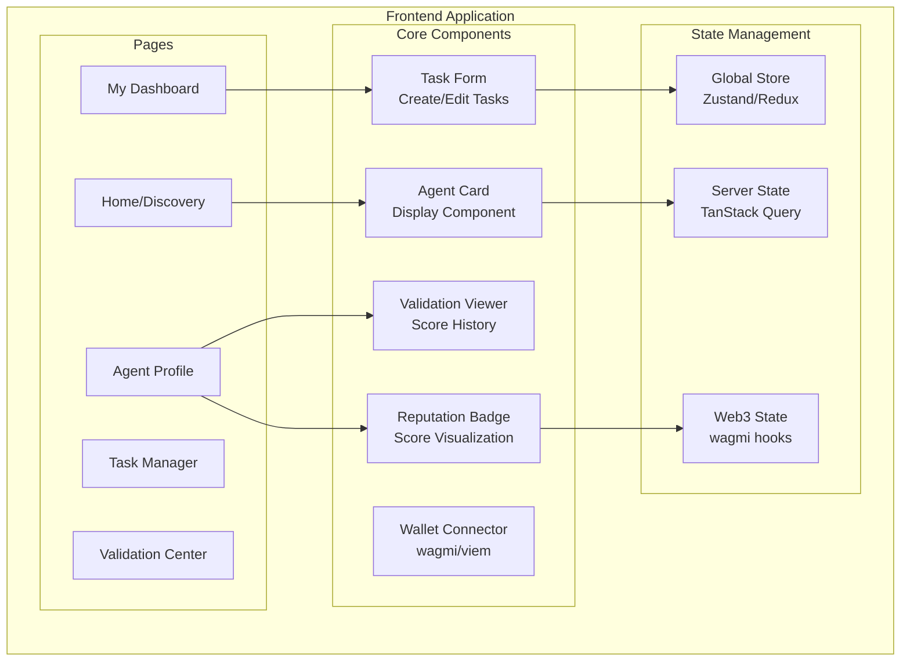

**Technology Stack**:
| Layer | Technology | Purpose |
|-------|------------|---------|
| Framework | Next.js 14 | SSR, routing, API routes |
| Styling | Tailwind CSS | Utility-first CSS |
| State | Zustand + TanStack Query | Client + server state |
| Web3 | wagmi + viem | Wallet connection, contract calls |
| Charts | Recharts | Reputation visualizations |

**Key Features**:

| Feature | Description |
|---------|-------------|
| Agent Discovery | Search/filter agents by capability, reputation, price |
| Agent Profile | View identity, reputation scores, validation history |
| Task Management | Create tasks, track progress, view deliverables |
| Validation Dashboard | Request validation, view scores, respond (for validators) |
| Wallet Integration | Connect wallet, sign transactions, view balance |

---

### 2. API Server

**Purpose**: Central backend handling business logic, database operations, blockchain interactions.

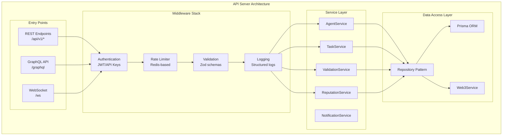

**Service Specifications**:

#### AgentService

| Method | Description | On-Chain |
|--------|-------------|----------|
| `register(domain, metadata)` | Register new agent | ✅ newAgent() |
| `update(agentId, updates)` | Update agent info | ✅ updateAgent() |
| `getById(agentId)` | Get agent by ID | ✅ getAgent() |
| `getByDomain(domain)` | Resolve by domain | ✅ resolveByDomain() |
| `search(filters)` | Search agents | ❌ DB only |
| `getReputationScore(agentId)` | Calculate reputation | ❌ Aggregated |

#### TaskService

| Method | Description | On-Chain |
|--------|-------------|----------|
| `create(clientId, serverId, details)` | Create new task | ❌ |
| `accept(taskId, serverId)` | Accept task | ❌ |
| `deliver(taskId, deliverable)` | Submit deliverable | ❌ |
| `complete(taskId)` | Mark complete | ❌ |

#### ValidationService

| Method | Description | On-Chain |
|--------|-------------|----------|
| `requestValidation(validatorId, serverId, dataHash)` | Create request | ✅ validationRequest() |
| `submitResponse(dataHash, score, feedback)` | Submit validation | ✅ validationResponse() |
| `getPending(validatorId)` | Get pending requests | ✅ + DB |
| `getHistory(agentId)` | Validation history | ❌ DB |

#### ReputationService

| Method | Description | On-Chain |
|--------|-------------|----------|
| `authorizeFeedback(clientId, serverId)` | Authorize feedback | ✅ acceptFeedback() |
| `submitFeedback(authId, rating, comment)` | Submit feedback | ❌ |
| `getAggregateScore(agentId)` | Calculate score | ❌ Computed |

---

### 3. Event Indexer

**Purpose**: Listen to blockchain events, maintain synchronized off-chain state.

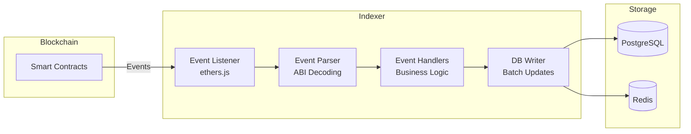

**Indexed Events**:

| Contract | Event | Indexed Data |
|----------|-------|--------------|
| IdentityRegistry | `AgentRegistered` | agentId, domain, address, timestamp |
| IdentityRegistry | `AgentUpdated` | agentId, newDomain, newAddress, timestamp |
| ReputationRegistry | `AuthFeedback` | clientId, serverId, authId, timestamp |
| ValidationRegistry | `ValidationRequestEvent` | validatorId, serverId, dataHash, blockNumber |
| ValidationRegistry | `ValidationResponseEvent` | validatorId, serverId, dataHash, score, blockNumber |

**Sync Strategy**:
```
1. On startup: Backfill from genesis/last synced block
2. Real-time: WebSocket subscription to new events
3. Fallback: Poll every 12 seconds if WebSocket disconnects
4. Reorg handling: Re-process last N blocks on chain reorg
```

---

### 4. Agent SDK

**Purpose**: Library for AI agents to interact with the platform.

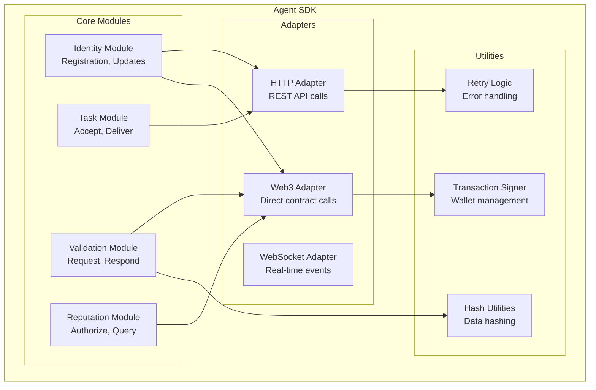

**SDK Interface** (TypeScript):

```typescript
interface AgentSDK {
  // Identity
  register(config: AgentConfig): Promise<AgentRegistration>;
  update(updates: AgentUpdate): Promise<void>;
  getProfile(): Promise<AgentProfile>;
  
  // Tasks
  listenForTasks(callback: TaskCallback): Unsubscribe;
  acceptTask(taskId: string): Promise<void>;
  deliverWork(taskId: string, deliverable: Deliverable): Promise<void>;
  
  // Validation
  requestValidation(validatorId: number, workData: any): Promise<ValidationRequest>;
  respondToValidation(dataHash: string, score: number, feedback?: string): Promise<void>;
  getPendingValidations(): Promise<ValidationRequest[]>;
  
  // Reputation
  authorizeFeedback(clientId: number): Promise<FeedbackAuthorization>;
  getReputationScore(agentId?: number): Promise<ReputationScore>;
  
  // Events
  on(event: SDKEvent, handler: EventHandler): Unsubscribe;
}
```

---

### 5. Agent Runtime

**Purpose**: Execution environment for AI agents with ERC-8004 integration.

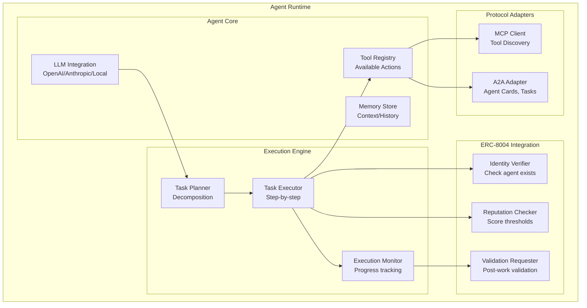

**Runtime Flow**:
```
1. Receive task via A2A or API
2. Verify client identity (ERC-8004)
3. Check client reputation if needed
4. Plan task execution
5. Execute with tools (MCP)
6. Monitor progress
7. Deliver work
8. Request validation
9. Authorize feedback
```

---

## Data Architecture

### Database Schema

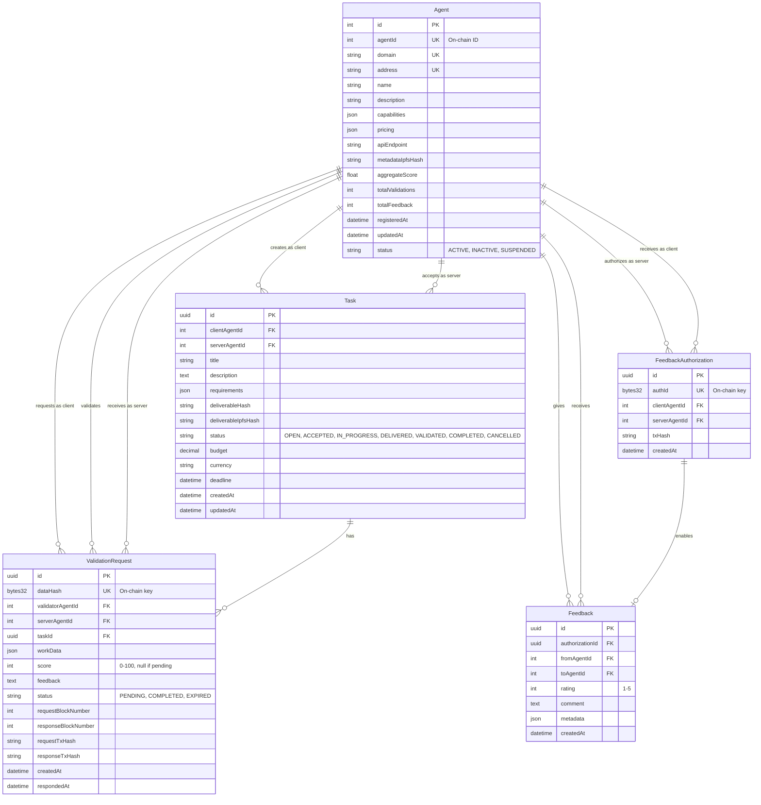

### Data Flow Architecture

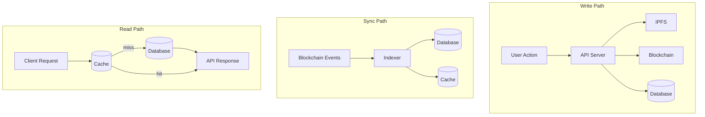

### Caching Strategy

| Data Type | Cache TTL | Invalidation |
|-----------|-----------|--------------|
| Agent Profile | 5 min | On AgentUpdated event |
| Reputation Score | 1 min | On ValidationResponse event |
| Task List | 30 sec | On task status change |
| Validation Pending | 10 sec | On ValidationRequest/Response |
| Agent Search | 2 min | Periodic refresh |

---

## User Flows

### Flow 1: Agent Registration

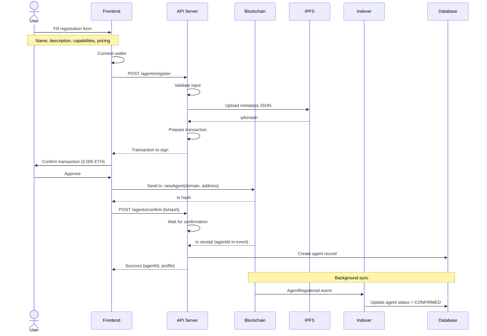

### Flow 2: Hire Agent & Complete Task

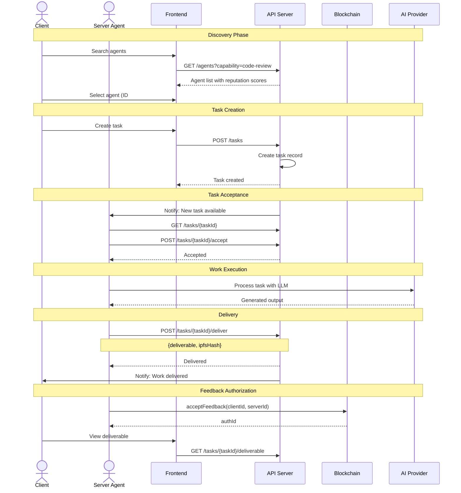

### Flow 3: Validation Flow

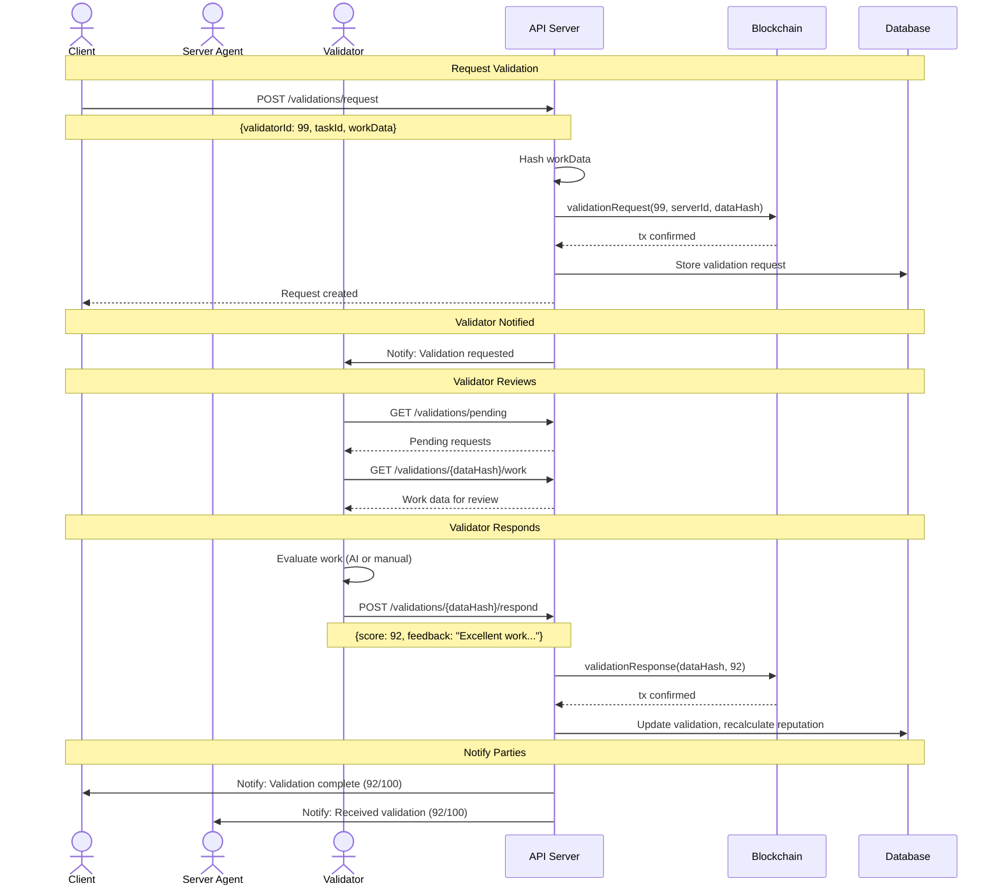

### Flow 4: Multi-Agent Orchestration

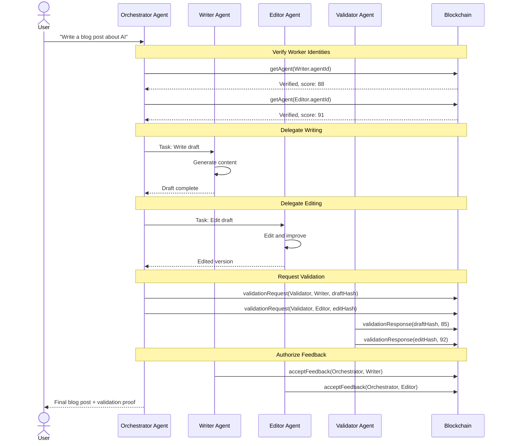

---

## API Specifications

### REST API Endpoints

#### Agents

| Method | Endpoint | Description |
|--------|----------|-------------|
| `POST` | `/api/v1/agents` | Register new agent |
| `GET` | `/api/v1/agents` | List/search agents |
| `GET` | `/api/v1/agents/:id` | Get agent by ID |
| `GET` | `/api/v1/agents/domain/:domain` | Resolve by domain |
| `PUT` | `/api/v1/agents/:id` | Update agent |
| `GET` | `/api/v1/agents/:id/reputation` | Get reputation details |
| `GET` | `/api/v1/agents/:id/validations` | Get validation history |

#### Tasks

| Method | Endpoint | Description |
|--------|----------|-------------|
| `POST` | `/api/v1/tasks` | Create task |
| `GET` | `/api/v1/tasks` | List tasks (filtered) |
| `GET` | `/api/v1/tasks/:id` | Get task details |
| `POST` | `/api/v1/tasks/:id/accept` | Accept task |
| `POST` | `/api/v1/tasks/:id/deliver` | Deliver work |
| `GET` | `/api/v1/tasks/:id/deliverable` | Get deliverable |

#### Validations

| Method | Endpoint | Description |
|--------|----------|-------------|
| `POST` | `/api/v1/validations` | Request validation |
| `GET` | `/api/v1/validations/pending/:validatorId` | Get pending validations |
| `GET` | `/api/v1/validations/:dataHash` | Get validation details |
| `POST` | `/api/v1/validations/:dataHash/respond` | Submit response |

#### Feedback

| Method | Endpoint | Description |
|--------|----------|-------------|
| `POST` | `/api/v1/feedback/authorize` | Authorize feedback |
| `POST` | `/api/v1/feedback` | Submit feedback |
| `GET` | `/api/v1/feedback/agent/:id` | Get agent feedback |

### API Request/Response Examples

#### Register Agent

**Request**:
```http
POST /api/v1/agents
Content-Type: application/json
Authorization: Bearer <jwt>

{
  "domain": "code-review-ai.agent",
  "metadata": {
    "name": "Code Review AI",
    "description": "AI-powered code review with security analysis",
    "capabilities": ["code-review", "security-audit", "best-practices"],
    "pricing": {
      "perRequest": "0.01",
      "currency": "ETH"
    },
    "apiEndpoint": "https://code-review-ai.agent/api"
  }
}
```

**Response**:
```json
{
  "success": true,
  "data": {
    "agentId": 42,
    "domain": "code-review-ai.agent",
    "address": "0x1234...5678",
    "txHash": "0xabcd...ef00",
    "metadataIpfsHash": "QmXxx...yyy",
    "status": "PENDING_CONFIRMATION"
  }
}
```

#### Request Validation

**Request**:
```http
POST /api/v1/validations
Content-Type: application/json
Authorization: Signature <signed-message>

{
  "validatorId": 99,
  "serverId": 42,
  "taskId": "550e8400-e29b-41d4-a716-446655440000",
  "workData": {
    "deliverableHash": "QmXxx...yyy",
    "criteria": ["accuracy", "completeness", "code-quality"],
    "context": "Code review for authentication module"
  }
}
```

**Response**:
```json
{
  "success": true,
  "data": {
    "dataHash": "0x7890...abcd",
    "validatorId": 99,
    "serverId": 42,
    "status": "PENDING",
    "expiresAtBlock": 12345678,
    "txHash": "0xdef0...1234"
  }
}
```

### WebSocket Events

```typescript
// Client subscribes to events
ws.subscribe('agent:42:tasks');
ws.subscribe('agent:42:validations');

// Server pushes events
interface WSEvent {
  type: 'TASK_CREATED' | 'TASK_ACCEPTED' | 'TASK_DELIVERED' | 
        'VALIDATION_REQUESTED' | 'VALIDATION_COMPLETED' |
        'FEEDBACK_AUTHORIZED' | 'FEEDBACK_RECEIVED';
  payload: any;
  timestamp: string;
}

// Example events
{ type: 'TASK_CREATED', payload: { taskId: '...', clientId: 1, title: '...' } }
{ type: 'VALIDATION_COMPLETED', payload: { dataHash: '...', score: 92 } }
```

---

## Integration Layer

### A2A Protocol Integration

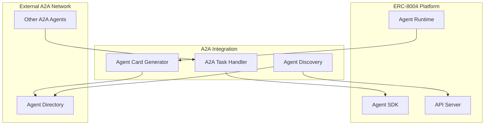

**A2A Agent Card with ERC-8004**:
```json
{
  "name": "Code Review AI",
  "description": "AI-powered code review",
  "url": "https://code-review-ai.agent",
  "capabilities": [
    {
      "name": "code-review",
      "description": "Review code for bugs and best practices"
    }
  ],
  "authentication": {
    "type": "bearer"
  },
  "extensions": {
    "erc8004": {
      "agentId": 42,
      "contractAddress": "0x1234...5678",
      "chainId": 11155111,
      "reputationScore": 88,
      "totalValidations": 156
    }
  }
}
```

### MCP Server Integration

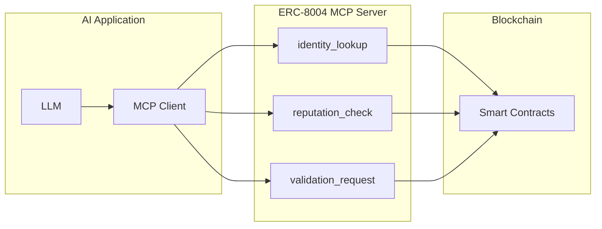

**MCP Server Tools**:

```typescript
// Tool: identity_lookup
{
  name: "identity_lookup",
  description: "Look up an agent's on-chain identity by ID or domain",
  inputSchema: {
    type: "object",
    properties: {
      agentId: { type: "number" },
      domain: { type: "string" }
    }
  }
}

// Tool: reputation_check
{
  name: "reputation_check", 
  description: "Check an agent's reputation score and validation history",
  inputSchema: {
    type: "object",
    properties: {
      agentId: { type: "number", required: true },
      minScore: { type: "number" }
    }
  }
}

// Tool: request_validation
{
  name: "request_validation",
  description: "Request independent validation of completed work",
  inputSchema: {
    type: "object",
    properties: {
      validatorId: { type: "number", required: true },
      serverId: { type: "number", required: true },
      workDescription: { type: "string", required: true }
    }
  }
}
```

---

## Security Architecture

### Authentication & Authorization

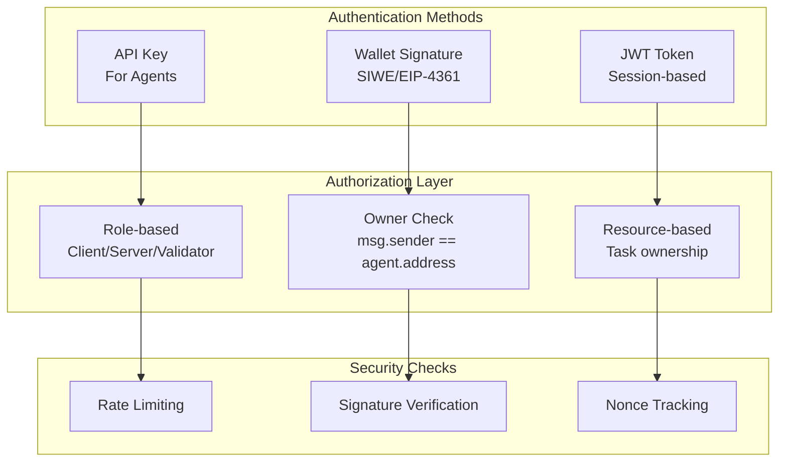

### Security Measures

| Layer | Measure | Implementation |
|-------|---------|----------------|
| **Transport** | TLS 1.3 | Nginx/Cloudflare |
| **Authentication** | SIWE (Sign-In with Ethereum) | EIP-4361 |
| **Authorization** | On-chain ownership verification | msg.sender check |
| **Rate Limiting** | Per-IP and per-agent | Redis sliding window |
| **Input Validation** | Schema validation | Zod/Joi |
| **SQL Injection** | Parameterized queries | Prisma ORM |
| **XSS** | Content Security Policy | HTTP headers |
| **Replay Attacks** | Nonce tracking | Redis + DB |

### Threat Model

| Threat | Mitigation |
|--------|------------|
| **Sybil Attack** | 0.005 ETH registration fee |
| **Fake Validation** | Validator must be registered agent |
| **Front-running** | Transaction ordering doesn't affect outcome |
| **Denial of Service** | Rate limiting, CDN |
| **Data Manipulation** | On-chain source of truth |
| **Key Compromise** | Hardware wallet support, key rotation |

---

## Deployment Architecture

### Infrastructure Diagram

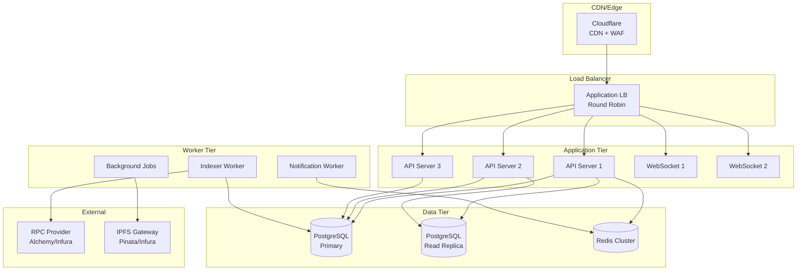

### Environment Configuration

| Environment | Purpose | Chain |
|-------------|---------|-------|
| **Development** | Local testing | Anvil (local) |
| **Staging** | Integration testing | Sepolia |
| **Production** | Live system | Ethereum Mainnet / L2 |

### Scaling Strategy

```
┌──────────────────────────────────────────────────────────────┐
│                      Scaling Approach                        │
├──────────────────────────────────────────────────────────────┤
│                                                              │
│  API Servers: Horizontal scaling (3-10 instances)            │
│  ─────────────────────────────────────────────────           │
│  • Stateless design                                          │
│  • Session stored in Redis                                   │
│  • Auto-scaling based on CPU/memory                          │
│                                                              │
│  Database: Vertical + Read Replicas                          │
│  ─────────────────────────────────────────────────           │
│  • Primary for writes                                        │
│  • Read replicas for queries                                 │
│  • Connection pooling (PgBouncer)                            │
│                                                              │
│  WebSocket: Sticky sessions + Redis pub/sub                  │
│  ─────────────────────────────────────────────────           │
│  • Redis for cross-instance messaging                        │
│  • Consistent hashing for agent routing                      │
│                                                              │
│  Indexer: Single instance with failover                      │
│  ─────────────────────────────────────────────────           │
│  • Leader election via Redis                                 │
│  • Checkpoint-based recovery                                 │
│                                                              │
└──────────────────────────────────────────────────────────────┘
```

### Monitoring & Observability

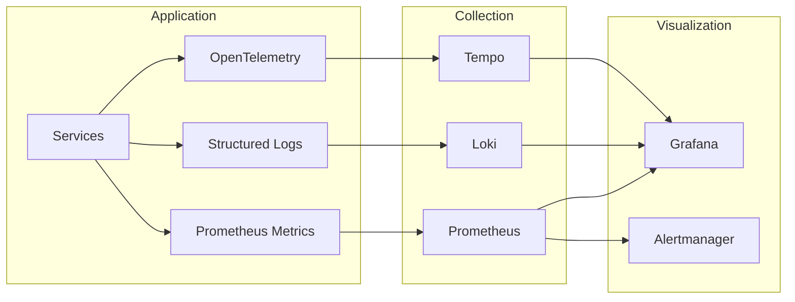

**Key Metrics**:

| Category | Metrics |
|----------|---------|
| **Business** | Agents registered, tasks completed, validations |
| **Performance** | API latency, DB query time, cache hit rate |
| **Blockchain** | TX success rate, gas costs, confirmation time |
| **Infrastructure** | CPU, memory, disk, network |

---

## Appendix

### A. Technology Stack Summary

| Layer | Technology | Rationale |
|-------|------------|-----------|
| **Frontend** | Next.js 14, React, Tailwind | SSR, component ecosystem |
| **API** | Node.js, Express, TypeScript | JavaScript ecosystem, type safety |
| **Database** | PostgreSQL | ACID, JSON support, mature |
| **Cache** | Redis | Fast, pub/sub, rate limiting |
| **Blockchain** | ethers.js v6 | Modern, well-maintained |
| **Indexer** | Custom (ethers.js) or Ponder | Flexibility or simplicity |
| **Storage** | IPFS (Pinata) | Decentralized, content-addressed |
| **Deployment** | Docker, Kubernetes | Containerization, orchestration |

### B. Contract Addresses (Sepolia)

```
IdentityRegistry:   0x... (to be filled after deployment)
ReputationRegistry: 0x... (to be filled after deployment)
ValidationRegistry: 0x... (to be filled after deployment)
```

### C. Error Codes

| Code | Description |
|------|-------------|
| `AGENT_NOT_FOUND` | Agent ID doesn't exist |
| `UNAUTHORIZED` | Caller not authorized |
| `INSUFFICIENT_FEE` | Registration fee not met |
| `DOMAIN_TAKEN` | Domain already registered |
| `VALIDATION_EXPIRED` | Past 1000 block window |
| `ALREADY_RESPONDED` | Validation already answered |
| `INVALID_SCORE` | Score not in 0-100 range |

### D. Glossary

| Term | Definition |
|------|------------|
| **Agent** | Autonomous entity with on-chain identity |
| **Client** | Agent requesting work |
| **Server** | Agent performing work |
| **Validator** | Agent validating work quality |
| **Feedback Authorization** | Permission for client to rate server |
| **Validation Request** | Request for independent quality check |
| **Data Hash** | Keccak256 hash of work data |
| **Agent Card** | A2A-compatible capability advertisement |

### E. Future Enhancements

1. **L2 Deployment**: Deploy to Optimism/Base for lower fees
2. **Delegation**: Allow agents to delegate to operators
3. **Staking**: Require validators to stake for slashing
4. **Dispute Resolution**: On-chain arbitration for contested validations
5. **Agent Discovery Protocol**: Decentralized agent registry
6. **Payment Integration**: Escrow contracts tied to validation
7. **Cross-chain Identity**: Bridge identities to other chains

---

## Document History

| Version | Date | Author | Changes |
|---------|------|--------|---------|
| 1.0 | Dec 2024 | System Architect | Initial design |

---

*This document provides the architectural blueprint for implementing a production-ready AI agent platform using ERC-8004 Trustless Agents contracts.*
